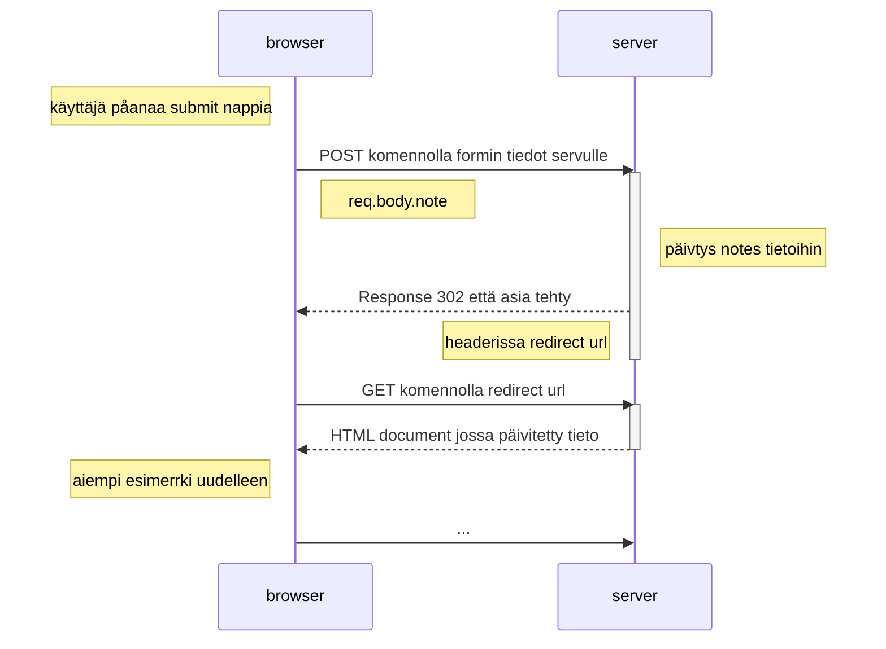

0.4 uusi muistiinpano



0.5 Single Page App

```mermaid
sequenceDiagram
    participant selain
    participant server
    
    selain->>server: GET https://studies.cs.helsinki.fi/exampleapp/spa
    activate server
    server-->>selain: 200, HTML document
    deactivate server
    
    selain->>server: GET https://studies.cs.helsinki.fi/exampleapp/main.css
    activate server
    server-->>selain: the css file
    deactivate server
    
    selain->>server: GET https://studies.cs.helsinki.fi/exampleapp/spa.js
    activate server
    server-->>selain: the JavaScript file
    deactivate server
    
    Note right of selain: The browser starts executing the JavaScript code that fetches the JSON from the server
    
    selain->>server: GET https://studies.cs.helsinki.fi/exampleapp/data.json
    activate server
    server-->>selain: [{ "content": "HTML is easy", "date": "2023-1-1" }, ... ]
    deactivate server    

    Note right of selain: selain luo html elementtiin tietojen mukaisen tiedon
 ```

0.6 Single Page App

```mermaid
sequenceDiagram
    participant browser
    participant funktio
    participant server

    browser ->> funktio: painetaan submit ja kutsutaan funktiota
    funktio ->> server: funktio lähettää html formissa olevat sevulle
    Note right of server: päivitettään noten tiedot
    server ->> funktio: palautetaan tieto päivityksestä
    funktio ->> browser: funktio päivittää selaimessa olevan tiedon


    
```